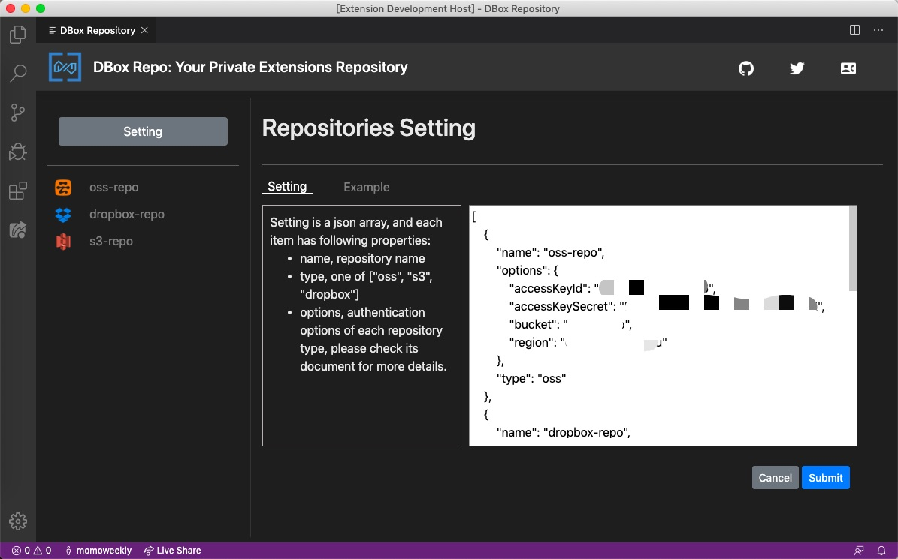
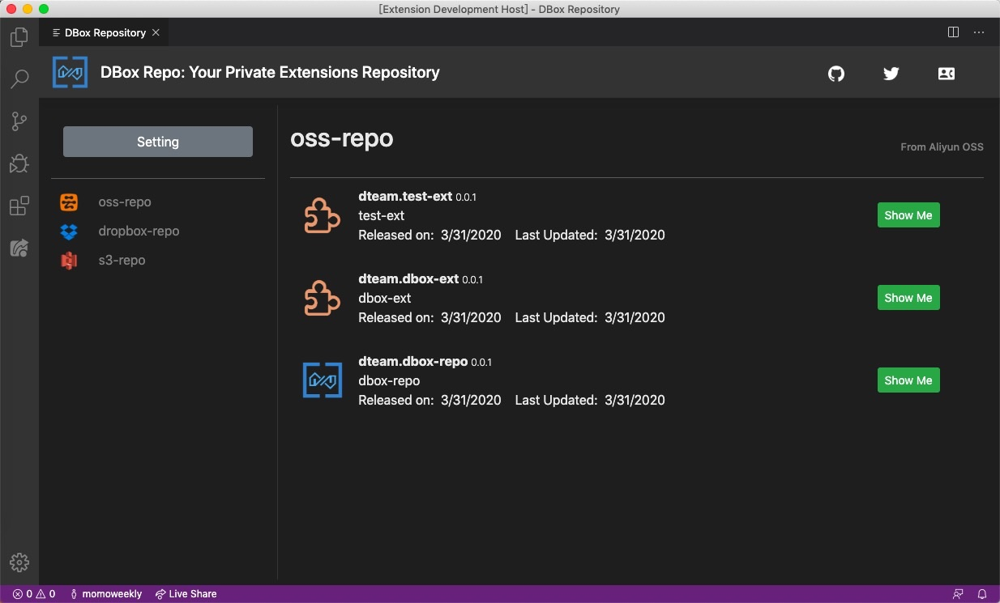
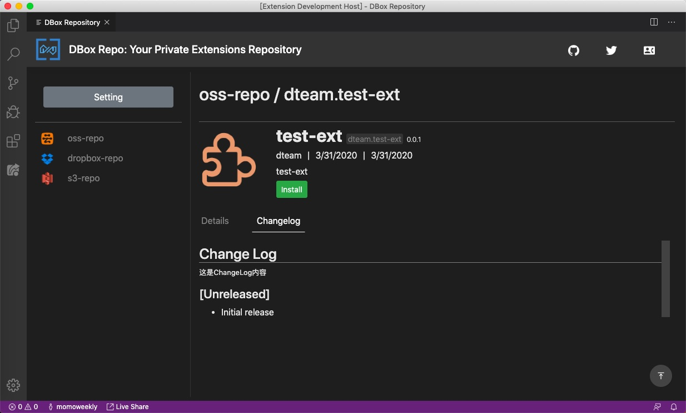

# DBox-Repo：私有 VS Code 插件仓库

[](https://github.com/google/gts)

[English](README.md)

本插件用于帮助企业或个人访问自己私有的 VS Code 插件仓库。并且，为配合插件发布体验跟现有 vsce 发布体验一致，还提供了相应的插件发布工具 dbem ，它提供了将插件发布到私有仓库的能力。

## 特性

- 轻量级配置，不需要特殊的插件仓库服务器，跟现有常见后端云存储直接适配。
- 支持多后端多仓库，其中支持的后端类型包括：阿里云 OSS、AWS S3 和 Dropbox。
- 提供了访问私有插件仓库的 Webview ，通过它可以完成：
  - 仓库访问设置。
  - 浏览仓库中包含的插件信息：插件列表和插件详情。
  - 下载并安装插件。
- 跟踪由本插件安装的私有插件状态：激活、禁用和卸载。
- 使用体验与 VS Code 现有的 “ Extensions ” 功能无缝对接：
  - 提供了相应命令列出本插件管理的私有插件，它们的信息会在 “ Extensions ” 视图中显示。
  - 使用同样的方式来卸载由本插件安装的私有插件。
- 支持国际化。
- 支持 dark 和 light 主题风格。

## 工作流程

和现有的 VS Code 插件的使用流程一样，使用 DBox-Repo 同样涉及到两个阶段：

- 发布插件，通过基于 vsce 改造 的 dbem ，开发者可以将自己开发的插件发布到自己的存储后端。
- 浏览和安装，通过 DBox-Repo ，使用者可以访问私有插件库，选择并安装所需插件。

整个过程如下图：


## 运行要求

VS Code >= 1.42.0

## 使用指南

整个使用流程很简单，只需要两步：

1. 输入命令 `dbox home`，进入管理页面，设置仓库访问信息。
1. 通过管理页面浏览仓库，选择合适的插件下载并安装。

### 示例页面

#### 主页


#### 设置



仓库配置例子如下：

```json
[
  {
    "name": "oss-repo",
    "options": {
      "accessKeyId": "...",
      "accessKeySecret": "...",
      "bucket": "dbox-repo",
      "region": "..."
    },
    "type": "oss"
  },
  {
    "name": "dropbox-repo",
    "options": {
      "accessToken": "...",
      "root": "dbox-repo"
    },
    "type": "dropbox"
  },
  {
    "name": "s3-repo",
    "options": {
      "bucket": "dbox-repo",
      "credentials": {
        "accessKeyId": "...",
        "secretAccessKey": "..."
      },
      "region": "..."
    },
    "type": "s3"
  }
]
```

#### 插件列表



#### 插件详情




### 命令

- `DBox: Show Extensions`，列出 DBox-Repo 安装的所有插件
- `DBox: Show Enabled Extensions`，列出 DBox-Repo 安装的所有*已激活*插件
- `DBox: Show Disabled Extensions`，列出 DBox-Repo 安装的所有*未激活*插件
- `DBox: Home`，进入管理页面

这些信息都罗列在 “Extensions” 视图中，使用体验跟现有使用方式一致。

卸载插件的方式也和现有方式一样：

1. 找到需要卸载的插件
1. 点击“卸载”
1. 重启后，已卸载插件将不会出现在管理页面的“已安装”区域。

## 已知问题

请访问工程目录的 [issues 页面](https://github.com/DTeam-Top/dbox-repo/issues)提交和查看。

## 发布日志

各版本的发布日志内容见下。

### 0.0.1

初次发布。
