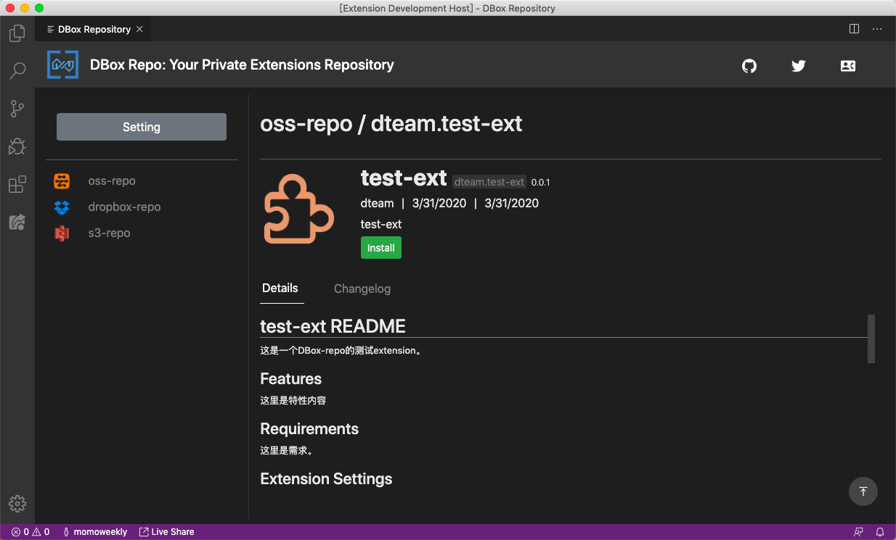

# DBox-Repo：Your personal VS Code Extensions Repository

[](https://github.com/google/gts)

[中文版](README-cn.md)

This extension provides a solution for private extensions repositories. With it, you can access and install extensions in your own extensions repository. In order to publish extensions to your private extensions repository, you can use `dbem` which is a fork of `vsce`.

## Features

- Light weight, no special repository server needed.
- Common cloud storage backends supported: Aliyun OSS, AWS S3 and Dropbox.
- Admin Webview, it will help you:
  - to config repository connection details.
  - to browse extensions in a repository.
  - to download and install extensions.
- Tracking status of extensions installed by DBox-Repo: enabled, disabled and uninstalled.
- Integration with existing VS Code "Extensions" view:
  - DBox-Repo provides commands to show those extensions tracked by it, and all those extensions will be shown in "Extensions" view.
  - You can uninstall the extensions installed by DBox-Repo in "Extensions" view, just like what you did to normal extensions.
- i18n supported.
- dark theme and light theme.

## Workflow

As with normal VS Code extensions, there are two steps to use your private extensions with DBox-Repo:

- Publish extensions to a private repository: with `dbem`, which is a fork of `vsce`, developers can publish extensions to those backends supported by DBox-Repo.
- Browse and install: with DBox-Repo, users can visit a private extensions respository, select and install extensions needed.

The whole workflow is shown below:


## Runtime Requirement

VS Code >= 1.42.0

## Usage

To make DBox-Repo running:

1. input `dbox home` command: it will bring you to admin GUI which could guide you to set repository connection details.
1. With the same admin GUI, you can browse extensions in repository and install the extension you select.

### Demo Pages

#### Home


#### Setting


Here is an example of Repositories Setting:

```json
[
  {
    "name": "oss-repo",
    "options": {
      "accessKeyId": "...",
      "accessKeySecret": "...",
      "bucket": "dbox-repo",
      "region": "..."
    },
    "type": "oss"
  },
  {
    "name": "dropbox-repo",
    "options": {
      "accessToken": "...",
      "root": "dbox-repo"
    },
    "type": "dropbox"
  },
  {
    "name": "s3-repo",
    "options": {
      "bucket": "dbox-repo",
      "credentials": {
        "accessKeyId": "...",
        "secretAccessKey": "..."
      },
      "region": "..."
    },
    "type": "s3"
  }
]
```

#### Extension List


#### Extension Details




### Commands

- `DBox: Show Extensions`, show all extensions installed by DBox-Repo.
- `DBox: Show Enabled Extensions`, show all _enabled_ extensions installed by DBox-Repo.
- `DBox: Show Disabled Extensions`, show all _disabled_ extensions installed by DBox-Repo.
- `DBox: Home`, enter admin GUI.

All results will be shown in "Extensions" view to achive the same user experience about extensions.

To uninstall an extension installed by DBox-Repo, in "Extensions" view:

1. Find the extension you want uninstall.
1. Click "uninstall".
1. After restarting VS Code, the uninstalled extension will not be shown in "Installed Extensions" section in admin GUI.

## Known Issues

Please visit [issues page](https://github.com/DTeam-Top/dbox-repo/issues) to submit new issues or check known issues.

## Release Notes

### 0.0.1

First release.
